# Лабораторная работа №1
## Прокат автомобилей. (вариант 22)
Фирма выдает напрокат автомобили. Информация об автомобиле (модель,
цвет, год выпуска, госномер, стоимость одного дня проката). Информация о
клиенте (ФИО, серия и номер паспорта). Накапливается информация о
прокатах, где накапливается информация о дате начала проката и количестве
дней проката. Стоимость одного дня проката может отличаться для разных
автомобилей.
Выходные документы.
 - Список прокатных документов за определенный период с указанием
стоимости проката и страхового взноса. Стоимость проката автомобиля
определяется как Стоимость одного дня проката · Количество дней
проката. Фирма ежегодно страхует автомобили, выдаваемые клиентам.
Страховой взнос, выплачиваемый фирмой, равен 10 процентам от
страховой стоимости автомобиля.
 - Список автомобилей, упорядоченный по моделям, а для каждой модели
 по убыванию года выпуска.
### ER-диаграмма (рис. 1)
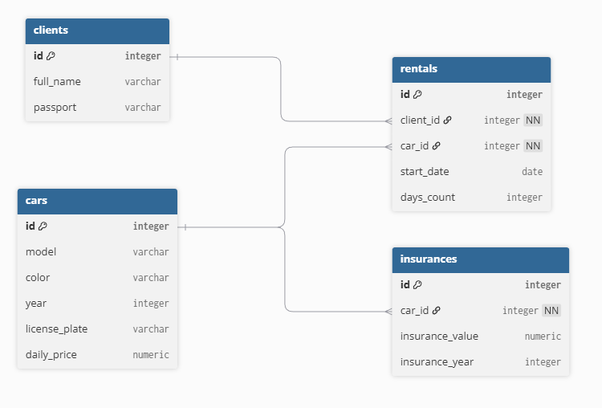

# Лабораторная работа №2
## Логическая модель
 ### Сущность Clients
- Назначение: хранение информации о клиентах
- атрибуты:
- - id - уникальный идентификатор клиента
- - full_name - ФИО
- - passport - паспортные данные
 ### Сущность Cars
- Назначение: хранение информации об автомобилях
- Атрибуты:
- - id - уникальный идентификатор автомбиля
- - model - модель
- - color - цвет
- - year - год выпуска
- - license_plate - гос. номер
- - current_daily_price - цена за день аренды
### Сущность Rentals
- Назначение: хранение информации о прокатах
- Атрибуты:
- - id - Уникальный идентификатор проката
- - client_id - ссылка на клиента
- - car_id — ссылка на автомобиль
- - start_date — дата начала проката
- - days_count — количество дней
- - price_at_rental - зафиксированная стоимость одного дня проката на момент оформления (для истории)
### Сущность Insurances
- Назначение: хранение информации о страховании автомобилей.
- Атрибуты:
- - id — уникальный идентификатор записи
- - car_id — ссылка на автомобиль
- - insurance_value — страховая стоимость автомобиля
- - insurance_year — год страхования
## Физическая модель
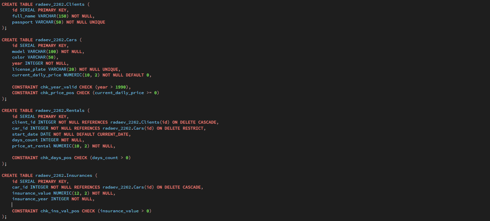
## DDL Запросы
### Создаем таблицы
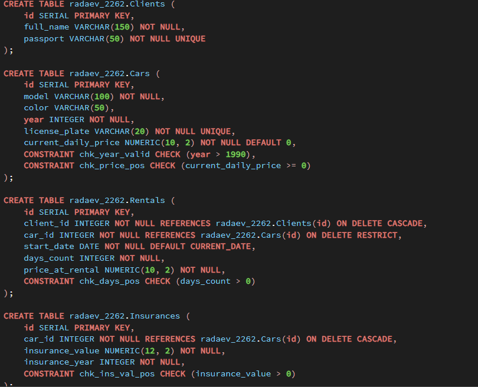
### Заполняем таблицы
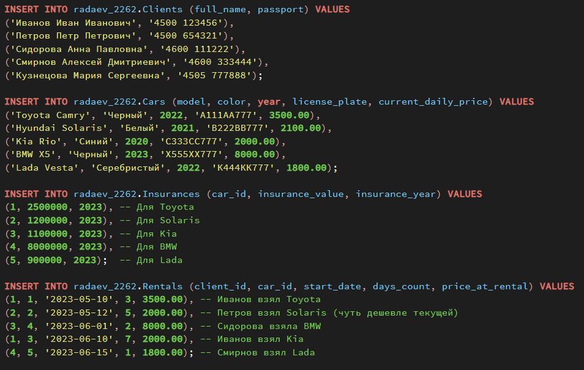
## SELECT запросы
Список прокатов с расчетами (страховой взнос 10% от оценочной стоимости авто)
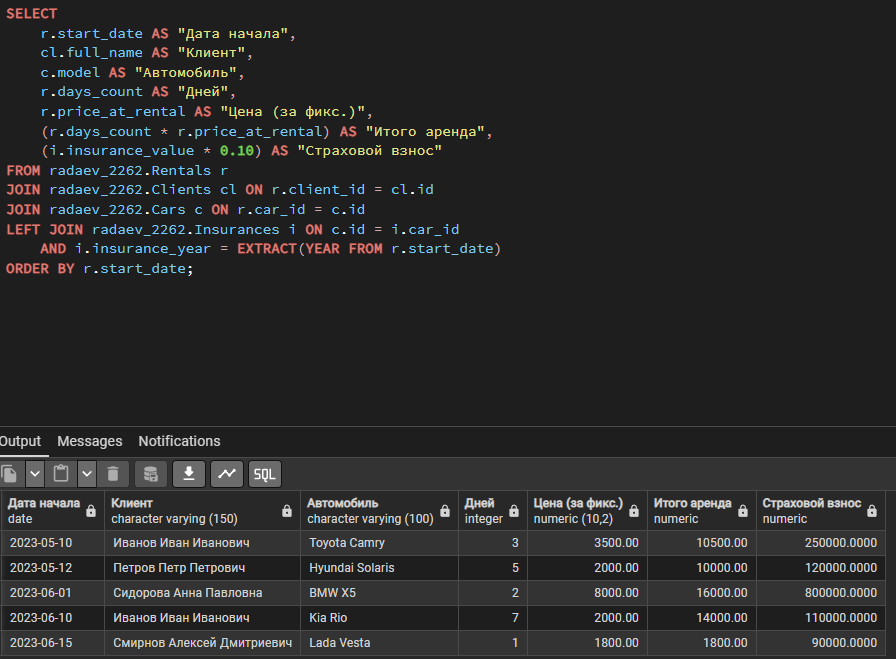
Список автомобилей и сортировка (А-Я + от новых к старым)
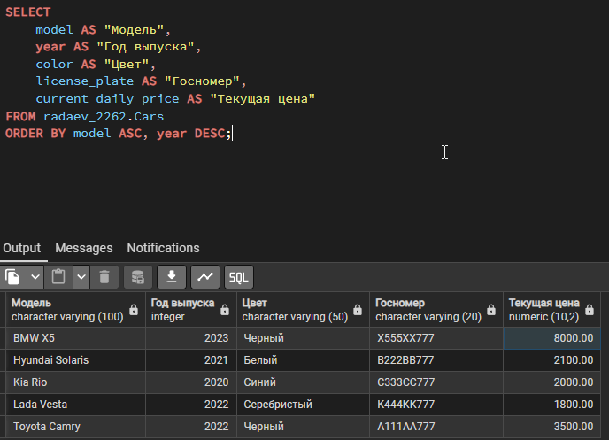
# Лабораторная работа 3
## Создание представлений
### Представление для отчета по прокатам

проверяем
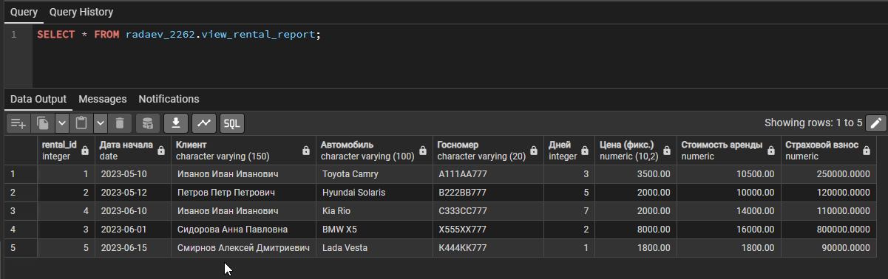
### Представление для списка авто
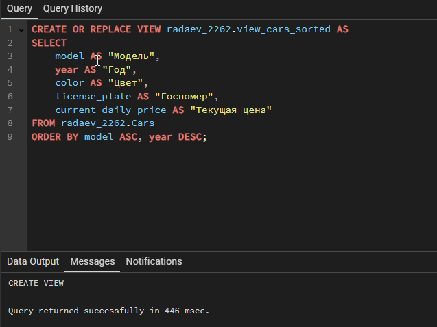
проверяем
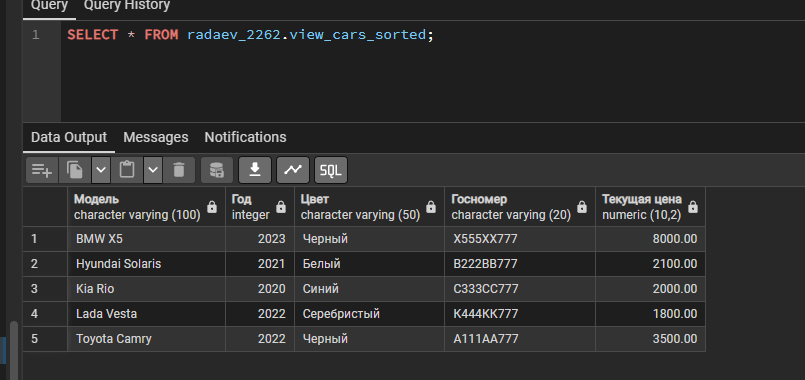
## Процедуры
### Оформление проката
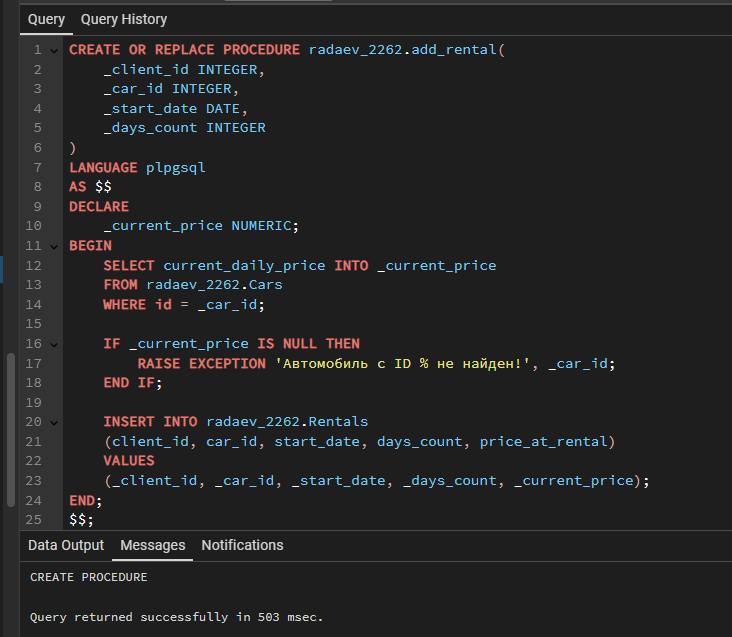
проверяем, сдаем машину №1 клиенту №2 на 5 дней
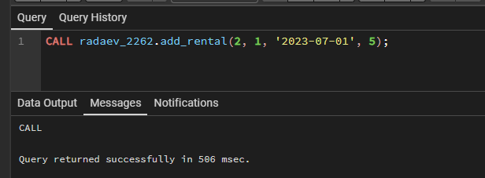
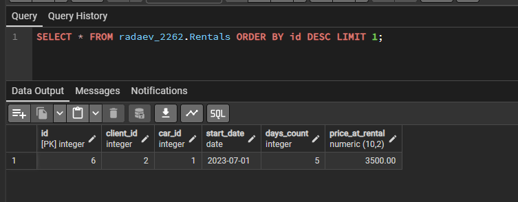
### Изменение цены авто
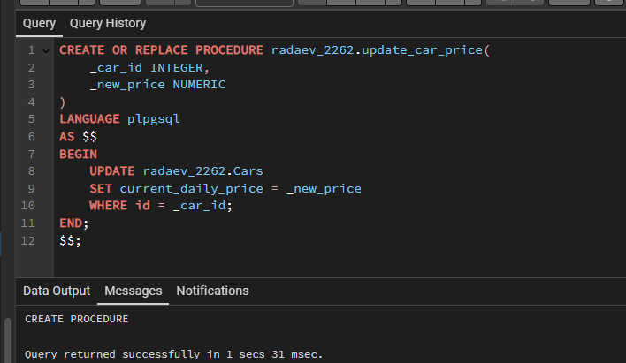
меняем стоимость машины 1 на 9999 рублей
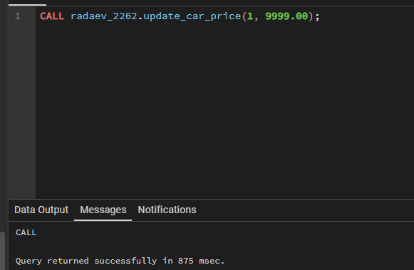
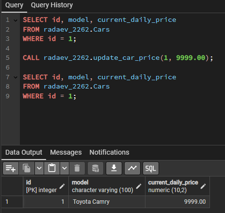
# Лабораторная работа 4
## Создаю генераторы, которые заполнят таблицы
### Генератор данных
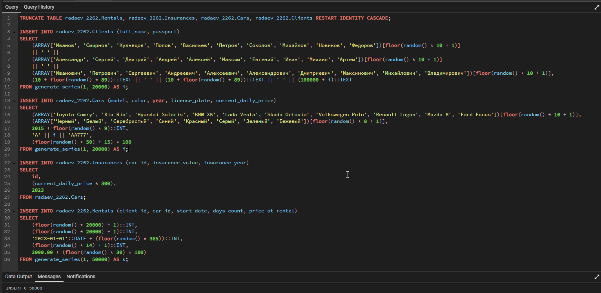
смотрим до оптимизации
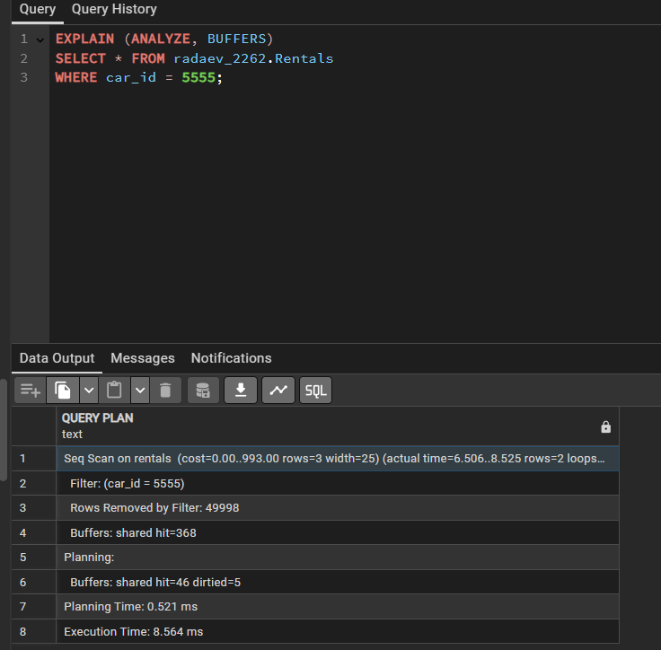
Добавляю оглавление по стоблцу car_id
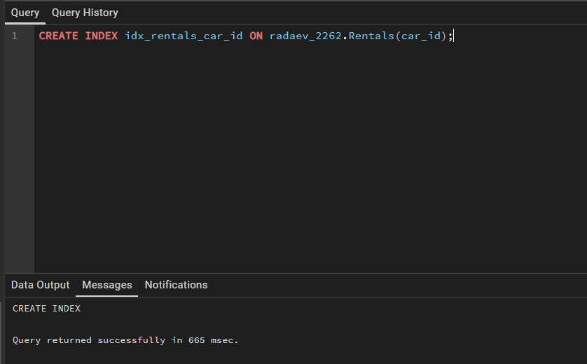
Теперь как выглядит после оптимизации
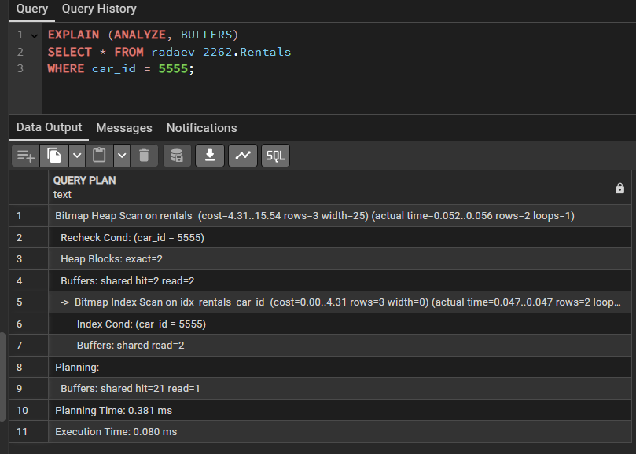
Исходя из данных таблицы, мы видим, что время выполнения запроса сократилось до 0.080 мс. Это более чем в 100 раз быстрее в отличие от первого запроса.
# Лабораторная работа 5
## Создание триггера
### При удалении машины триггер будет удалять все её страховки
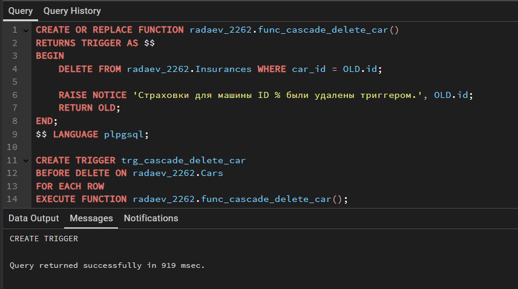
### Универсальный аудит
Журнал, в котором будем писать всё, что происходит с таблицей Clients
Журнал для аудита
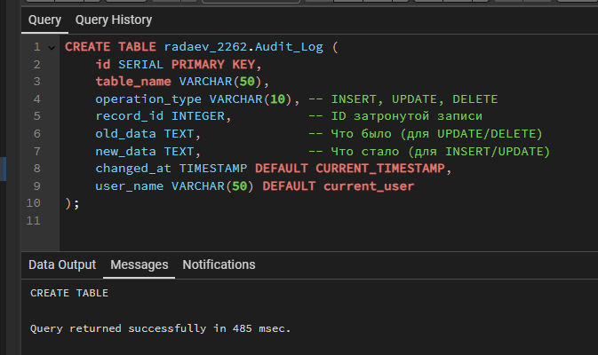
Функция Аудита (запись изменений)
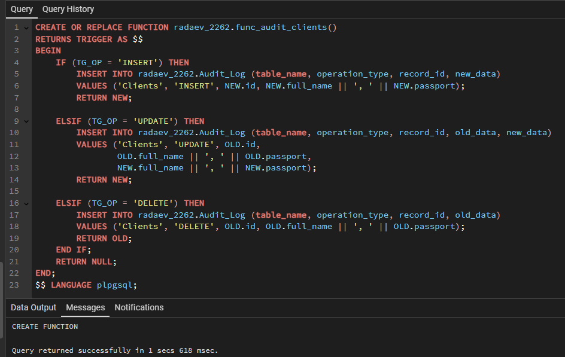
Триггер на таблице
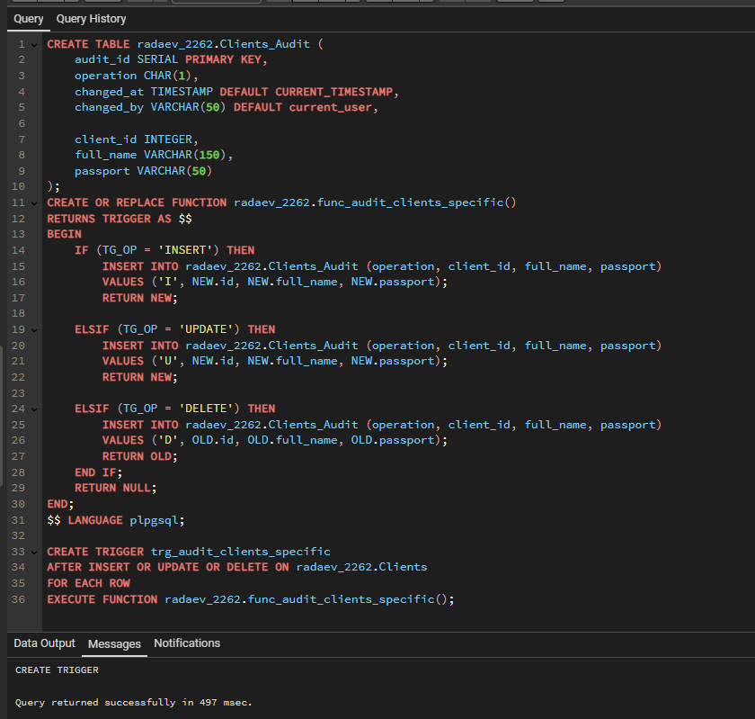
### финальная проверка
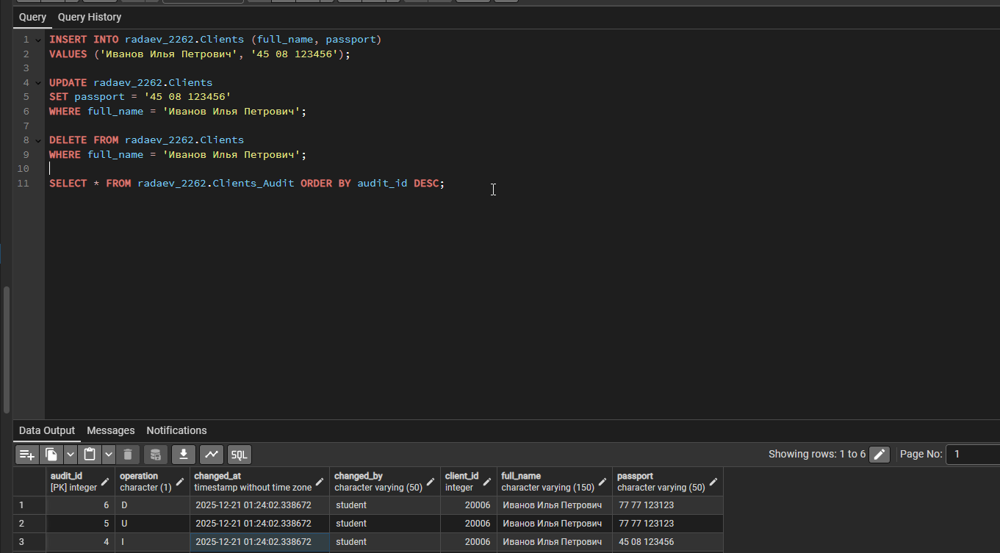